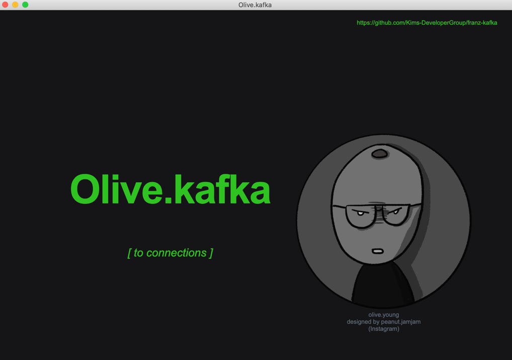

<div align="center">
<h1>Kafka gui client</h1>
<i>The tool is a gui client for kafka</i>
</div>
<br/>

## Starting Development

```bash
yarn dev
```

## Packaging for Production
To package apps for the local platform:
```bash
yarn package
```
